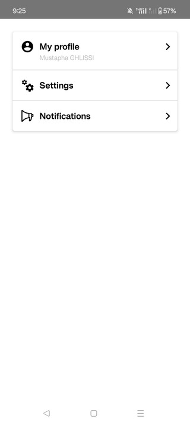
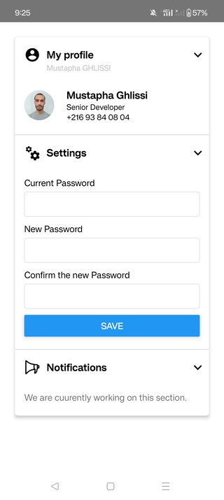
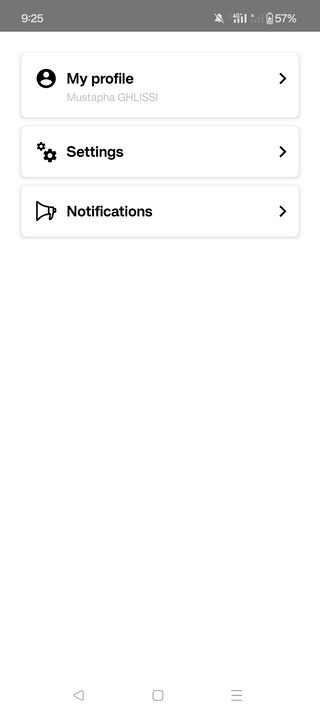

# React Native Accordion
`@mustapha-ghlissi/react-native-accordion`: a Collapsible Sections for React Native.

[](https://choosealicense.com/licenses/mit/)
[](https://www.npmjs.com/package/@mustapha-ghlissi/react-native-accordion)
[](https://www.npmjs.com/package/@mustapha-ghlissi/react-native-accordion)
[](https://www.npmjs.com/package/@mustapha-ghlissi/react-native-accordion)

## Screenshots






## Demo


## Example
You can check out this [<u><b>Example</b></u>](./example/).

## Installation
##### Installing the package
Use `npm` or `yarn` to install the package.

``` sh
npm i @mustapha-ghlissi/react-native-accordion
```

``` sh
yarn add @mustapha-ghlissi/react-native-accordion
```

##### Installing dependencies
``` sh
npm i react-native-reanimated react-native-vector-icons
```

``` sh
yarn add react-native-reanimated react-native-vector-icons
```

> Note: to finish the installation, you have to finish configuring the installed dependencies [react-native-reanimated](https://docs.swmansion.com/react-native-reanimated/docs/fundamentals/getting-started/) and [react-native-vector-icons](https://github.com/oblador/react-native-vector-icons).

## Usage
``` tsx
import {Accordion, AccordionItem} from '@mustapha-ghlissi/react-native-accordion';

<Accordion>
    <AccordionItem
        title="Section 1"
        subTitle="SubSection 1">
        {/* Put section body content here */}
    </AccordionItem>
    <AccordionItem title="Section 2">
        {/* Put section body content here */}
    </AccordionItem>
    <AccordionItem title="Section 3">
        {/* Put section body content here */}
    </AccordionItem>
</Accordion>
``` 

## Common Props
>### Common Props has specific effects depends on the Component.
<p>If one of the follinwg props is used in the <b>Accordion</b> Component, then it'll be applied <b>GLOBALLY</b> to all the Items !</p>
<p>If you need to customize only some Items, then you have to pass directly the props to <b>AccordionItem</b> Component.</p>

| Parameter | Type     | Description                |
| :-------- | :------- | :------------------------- |
| androidRipple | [`RippleConfig`](https://reactnative.dev/docs/0.73/pressable#rippleconfig): optional | Define the ripple of the pressable when pressing in the Accordion Item. |
| leftIcon | `string` , `ReactNode`: optional | Accordion Item left icon. |
| titleStyle | [`TextStyle`](https://reactnative.dev/docs/text-style-props): optional | Accordion item title style. |
| subTitleStyle | [`TextStyle`](https://reactnative.dev/docs/text-style-props): optional | Accordion item sub-title style. |
| titleContainerStyle | [`ViewStyle`](https://reactnative.dev/docs/view-style-props): optional | Accordion item title container style. |
| headerStyle | [`ViewStyle`](https://reactnative.dev/docs/view-style-props): optional | Accordion item header style. |
| itemContainerStyle | [`ViewStyle`](https://reactnative.dev/docs/view-style-props): optional | Accordion item container style. |
| contentContainerStyle | [`ViewStyle`](https://reactnative.dev/docs/view-style-props): optional | Accordion item body style. |
| contentWrapperStyle | [`ViewStyle`](https://reactnative.dev/docs/view-style-props): optional | Accordion item body wrapper style. |

## Accordion Props
>### All common Props can be used here in addition to the following Props:

| Parameter | Type     | Description                |
| :-------- | :------- | :------------------------- |
| containerStyle | [`ViewStyle`](https://reactnative.dev/docs/view-style-props): optional | Accordion container style. |
| animationDuration | `number`: optional | The duration of the collapse action |
| compact | `boolean`: optional | Define if the Accordion Items are compact or not. |

## Accordion Item Props
>### All common Props can be used here in addition to the following Props:

| Parameter | Type     | Description                |
| :-------- | :------- | :------------------------- |
| title | `string`: required | Accordion item title. |
| subTitle | `string`: optional | Accordion item sub-title |
| header | `ReactNode`: optional | Custom accordion item header component. |
| rightIcon | `string` , `ReactNode`: optional | Accordion Item right icon (default = `chevron-right`). |

## Advanced Usage
``` tsx
import {Accordion, AccordionItem} from '@mustapha-ghlissi/react-native-accordion';

const styles = StyleSheet.create({
    titleStyle: {
        fontSize: 16,
        fontWeight: 700,
    },
    contentContainerStyle: {
        paddingTop: 15,
        paddingBottom: 20
    }
});

<Accordion
    compact
    animationDuration={250}
    titleStyle={styles.titleStyle}
    contentContainerStyle={styles.contentContainerStyle}>
    <AccordionItem
        rightIcon='account'
        title="Section 1"
        subTitle="SubSection 1">
        {/* Put section body content here */}
    </AccordionItem>
    <AccordionItem
        rightIcon={<Icon name='cogs' size={26} color='#000' />}
        title="Section 2"
    >
        {/* Put section body content here */}
    </AccordionItem>
    <AccordionItem title="Section 3">
        {/* Put section body content here */}
    </AccordionItem>
</Accordion>
``` 

## Donate
<p>Please contribute or donate so we can spend more time on this library.</p>

[Donate with Wise by clicking this link](https://wise.com/pay/me/mustaphag6) or by scanning the QRCode
<br />


## Authors
- [@mustapha-ghlissi](https://www.github.com/mustapha-ghlissi)

## Other libraries
- [React Native OTP](https://github.com/mustapha-ghlissi/react-native-otp): One time password input for React Native.
- [React Native Select Picker](https://github.com/mustapha-ghlissi/react-native-select-picker): Dropdown select for React Native.
